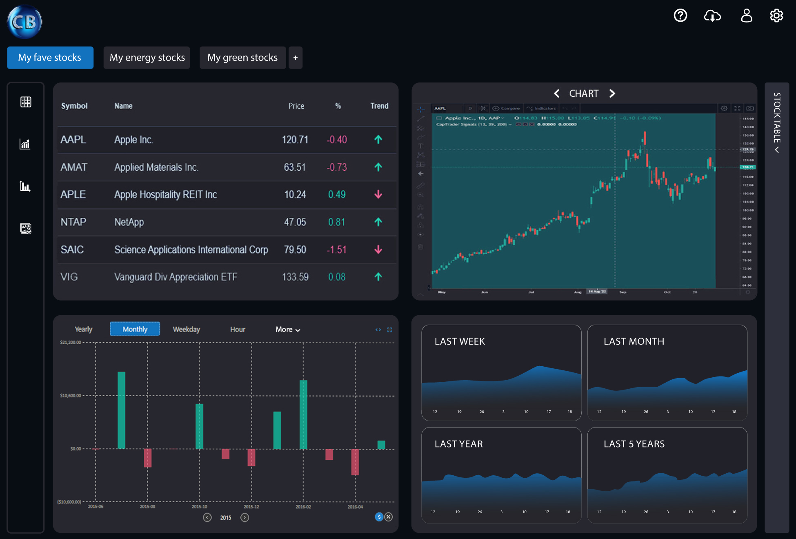

# React-based web application for traders

This project was created in 2020 as a beginning step to create a fully-customized dashboard used by traders. It is basically a user interface that displays financial data in real time (or near real time) to help traders make informed decisions. It's used in stock, forex, crypto, and commodities markets.

## 📸 Screenshot




## 🚀 Features

### `Clarity`

Quickly communicate key financial indicators (price, volume, trend).


### `Interactivity`

Let users filter, zoom, switch timeframes, or select indicators.


### `Responsiveness`

Works smoothly across desktop, tablet, and sometimes mobile.


### `Visual Hierarchy`

Prioritize important info (e.g., current price, P/L) and use consistent font sizes, colors, and spacing.


### `Real-time Updates:`

Auto-refresh charts and metrics without full reloads.


## 🛠️ Tech Stack (UI-focused)

- **Frontend**: React, JSX, D3.js, Chart.js, Recharts

- **Styling**: Tailwind, SCSS, CSS Grid/Flexbox

- **Data Feeds**: WebSocket, REST APIs for market data (e.g., Binance, Alpha Vantage)

- **Design Patterns**: Modular components, light/dark themes, accessibility


## 🖼️ Common Visual Elements

- **Candlestick Charts**: to show price movements over time

- **Line/Area Charts**: for trends

- **Volume Bars**: to show trade activity

- **Indicators**: like RSI, MACD, Bollinger Bands

- **News Ticker**: Real-time headlines or alerts

- **Watchlist Panel**: to track selected assets

## 📁 Folder Structure

```bash
├── public/
├── src/
│   ├── components/
│   ├── pages/
│   ├── services/
│   └── styles/
├── .env
├── README.md
└── package.json